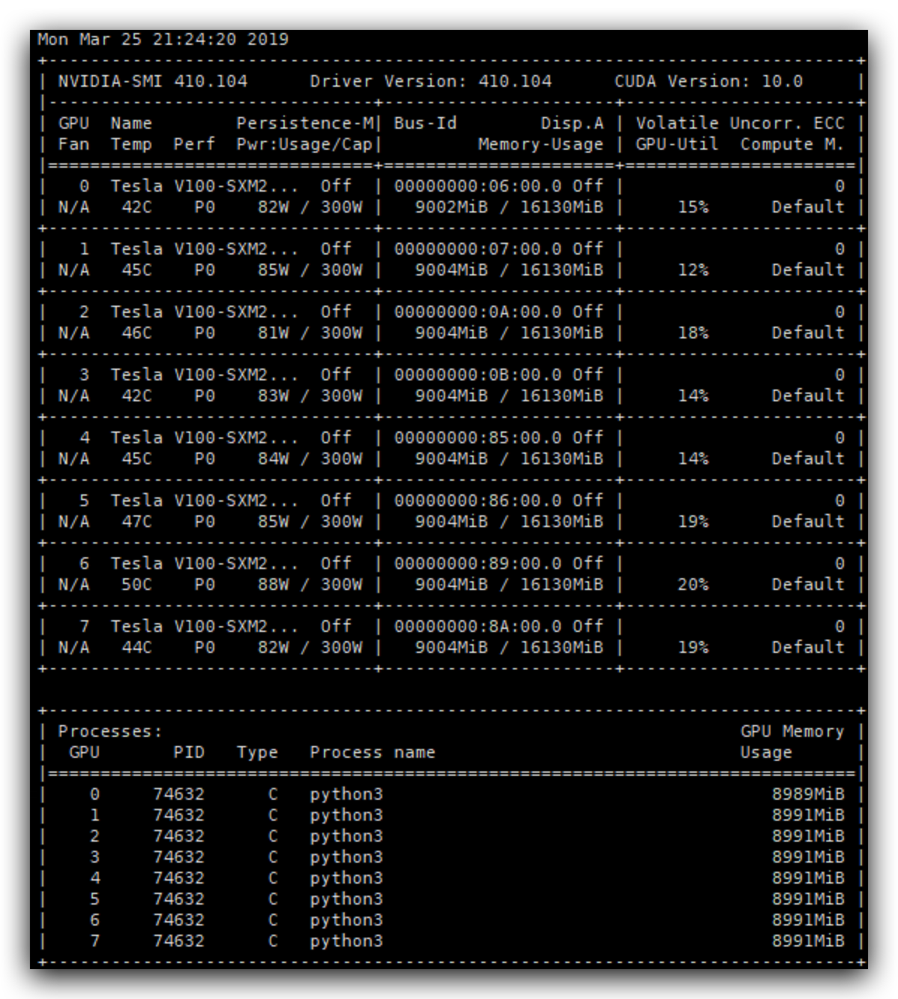

# tacotron_tf

项目是在HPC上用singulairy运行tensorflow1.2.0版本的tacotron2并配置了相关python包，见(requirements.txt "requirements.txt")

镜像配置来源于nvidia/cuda:9.0-cudnn7-devel-ubuntu16.04

值得注意的是虽然宿主机是CUDA10的并不影响，还有就是这里cudnn7作为环境不可缺少（因为服务器一般不会根目录下cuda文件目录开放权限

## Usage
singularity pull docker://xzhou2333/tacotron_tf

singularity exec --nv -H 家目录 --pwd /mnt/tacotron2 --bind 宿主机目录:/mnt tacotron_tf_latest.sif python3 train.py
